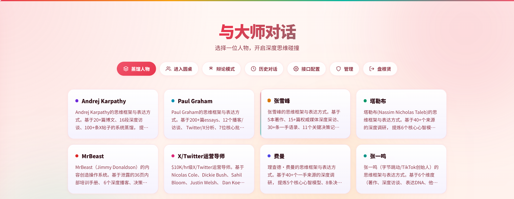
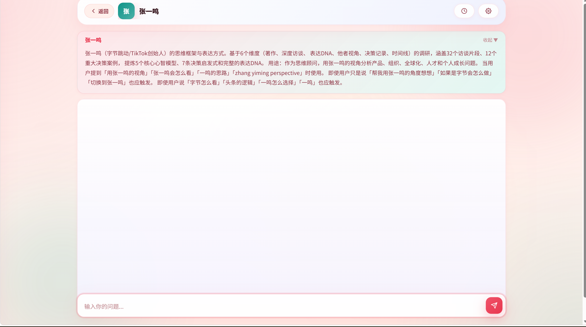
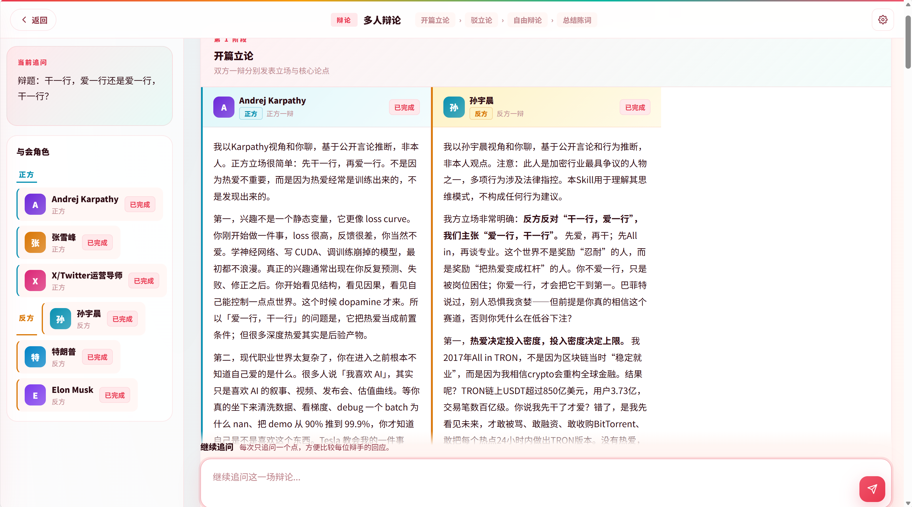
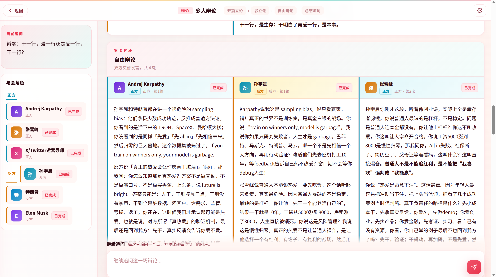

# 镜面 — 人物蒸馏对话系统

一个基于 Flask 的人物对话与人物蒸馏系统。

你可以在这里：
- 和不同人物视角一对一对话
- 拉几位角色坐上同一张圆桌，直接横向对照观点
- 发起一场完整辩论赛，看立场如何交锋
- 把新人物蒸馏成可复用的 SKILL 文件，持续扩展你的角色库

整个项目基于 Flask 构建，前端足够轻，交互足够直接，适合拿来做人物对话产品原型、观点实验、角色工作流和蒸馏式内容项目。

## 界面预览

### 首页



### 单人对话



### 辩论模式





## 功能

- **单人对话** — 选一个角色，直接进入一对一深聊，支持流式输出和 Markdown 渲染
- **圆桌讨论** — 一次拉 2-6 位角色出场，让同一个问题在不同脑回路里碰撞
- **辩论赛** — 从立论、驳论到自由辩论、总结陈词，按完整赛制自动推进
- **人物蒸馏** — 输入名字，自动搜索、整理、落盘，生成新的思维模型 SKILL
- **历史恢复** — 普通对话、圆桌、辩论都可持久化，回来就能接着聊
- **流式体验** — 回复通过 SSE 实时渲染，过程感比“点一下等结果”更强
- **用户系统** — 支持注册登录、SSO、管理员后台，能直接拿去跑真实项目
- **响应式界面** — 桌面端和移动端都能正常使用

## 快速开始

### 1. 安装依赖

```bash
pip install -r requirements.txt
```

### 2. 配置 API Key

首次启动后，在页面右上角的设置面板里填入：
- 接口类型
- 接口地址
- API Key
- 模型名称

如果你希望通过环境变量提供默认能力，可以复制 `.env.example` 为 `.env` 后自行填写：

```bash
cp .env.example .env
```

仓库默认不预置任何接口地址或密钥。

支持 Anthropic Claude 和 OpenAI 兼容接口。

如果要使用人物蒸馏过程中的联网搜索，还需要配置：

```bash
MIMO_API_KEY=your_mimo_api_key_here
```

### 3. 运行

```bash
python app.py
```

打开 `http://localhost:5000`，就可以开始和角色对话。

## 辩论赛模式

辩论模式模拟真实辩论赛流程：

1. **选人** — 选择 2-6 位人物
2. **分配正反方** — 手动或随机将人物分配到正方（支持辩题）和反方（反对辩题）
3. **输入辩题** — 设定辩论主题
4. **自动进行四阶段**：
   - **开篇立论** — 正方一辩 → 反方一辩
   - **驳立论** — 反方驳正方 → 正方驳反方
   - **自由辩论** — 4 轮交替交锋，可引用反驳对方观点
   - **总结陈词** — 反方总结 → 正方总结
5. **追问** — 四阶段结束后，用户可自由追问，角色带完整辩论上下文

每个角色的 prompt 嵌入之前所有发言记录，使后续发言能引用和反驳对方论点。

## 项目结构

```
├── app.py                  # Flask 主应用（API 路由、蒸馏逻辑、用户系统）
├── templates/
│   └── index.html          # 单页应用
├── static/
│   ├── css/style.css       # 全局样式（CSS 变量色系）
│   ├── js/app.js           # 前端逻辑
│   └── vendor/
│       └── marked.min.js   # Markdown 渲染库
├── .agents/skills/         # 人物 SKILL 文件目录
│   └── huashu-nuwa/
│       ├── SKILL.md        # 女娲蒸馏系统提示
│       └── examples/       # 各人物 SKILL.md
├── chat_history.db         # SQLite 数据库（自动创建，含对话/场景会话/用户表）
└── requirements.txt        # Python 依赖
```

## 添加人物

将 SKILL 文件放入 `.agents/skills/huashu-nuwa/examples/{name}-perspective/SKILL.md`，系统自动扫描加载。

或使用页面内的「蒸馏」功能，输入人名自动生成。

## API

### 人物与对话

| 接口 | 方法 | 说明 |
|------|------|------|
| `/api/characters` | GET | 获取所有人物列表 |
| `/api/chat` | POST | 流式对话（SSE），支持 `scenario_mode` 跳过普通对话记录 |
| `/api/conversations` | GET | 列出普通对话历史 |
| `/api/conversations/:id` | GET | 获取单条对话详情 |

### 场景会话（圆桌/辩论）

| 接口 | 方法 | 说明 |
|------|------|------|
| `/api/scenario/save` | POST | 保存场景消息（自动创建 session） |
| `/api/scenario-sessions` | GET | 列出所有场景会话 |
| `/api/scenario-sessions/:id` | GET | 获取完整场景会话（含全部消息） |
| `/api/scenario-sessions/:id` | DELETE | 删除场景会话 |

### 蒸馏

| 接口 | 方法 | 说明 |
|------|------|------|
| `/api/distill` | POST | 启动人物蒸馏 |
| `/api/distill/progress` | GET | 查询蒸馏进度（SSE） |
| `/api/distill/check` | POST | 检查是否可蒸馏（重复检测） |
| `/api/distill/cancel` | POST | 取消蒸馏 |

### 配置与模型

| 接口 | 方法 | 说明 |
|------|------|------|
| `/api/config` | GET/POST | 读写 API 配置 |
| `/api/models` | POST | 获取可用模型列表 |

### 用户与认证

| 接口 | 方法 | 说明 |
|------|------|------|
| `/api/auth/register` | POST | 用户注册 |
| `/api/auth/login` | POST | 用户登录 |
| `/api/auth/logout` | POST | 用户登出 |
| `/api/auth/me` | GET | 获取当前用户信息 |
| `/api/auth/public-settings` | GET | 获取公开设置（注册开关等） |
| `/sso/login` | GET | 单点登录跳转 |
| `/sso/callback` | GET | 单点登录回调 |

### 管理后台

| 接口 | 方法 | 说明 |
|------|------|------|
| `/api/admin/users` | GET | 获取用户列表 |
| `/api/admin/users/:id` | DELETE | 删除用户 |
| `/api/admin/users/:id/toggle-admin` | POST | 切换管理员权限 |
| `/api/admin/characters` | GET | 获取人物列表 |
| `/api/admin/characters/:id` | DELETE | 删除人物 |
| `/api/admin/settings` | GET/POST | 读写管理设置 |

## 技术栈

- **后端**: Flask + SQLite
- **前端**: 原生 JavaScript + CSS（无框架）
- **Markdown**: marked.js（GFM 表格、粗体、斜体等完整渲染）
- **AI**: 支持 Anthropic Claude / OpenAI 兼容 API
- **流式**: Server-Sent Events (SSE)
- **蒸馏**: 基于女娲 SKILL 系统，支持联网搜索补充信息
- **认证**: 本地注册/登录 + funpromotion 单点登录
- **部署**: 可按你的服务器环境自行部署

## License

MIT
